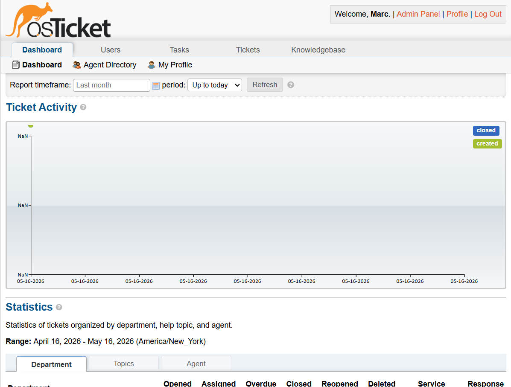
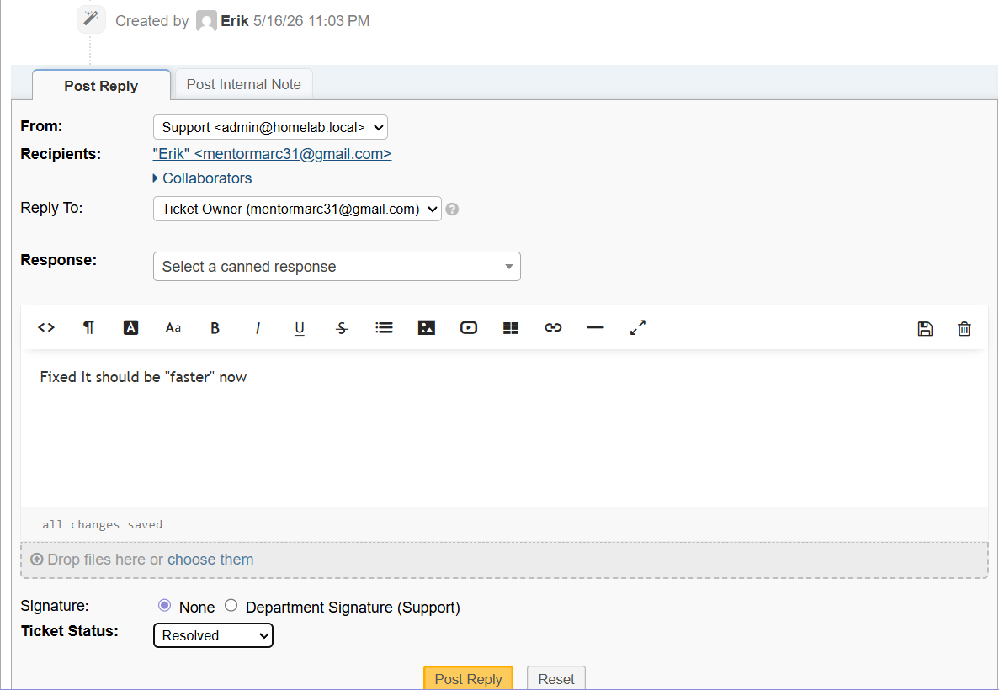

# osTicket-Help-Desk-System
Deploy a fully functional, open‑source ticketing system (osTicket) in a Proxmox LXC container, then configure departments, agents, and workflows to simulate a real help desk.
## Help Desk Simulation

- Created a Support department, an agent (John Agent), two SLA plans (Standard 4h, Critical 1h), and three help topics (Network, Hardware, Software)
- Simulated a full ticket lifecycle: a user submitted a VPN issue via the client portal, an agent responded and resolved the ticket
- All steps documented with screenshots

